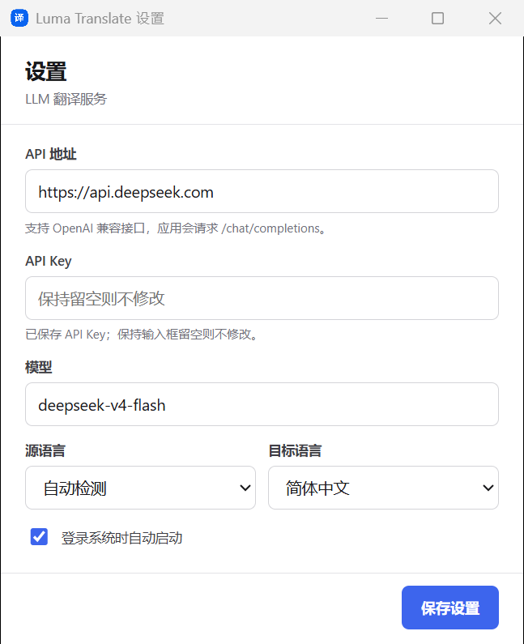

# Luma Translate

<p align="center">
  
</p>

<p align="center">
  <strong>轻量、跨平台的 AI 划词翻译工具</strong><br>
  Cross-platform AI selection translator powered by OpenAI-compatible LLM APIs.
</p>

<p align="center">
  <a href="https://github.com/surinchan/luma-translate/actions/workflows/ci.yml"></a>
  <a href="https://github.com/surinchan/luma-translate/releases/latest"></a>
  <a href="https://github.com/surinchan/luma-translate/releases"></a>
  <a href="LICENSE"></a>
</p>

<p align="center">
  <a href="https://github.com/surinchan/luma-translate/releases/latest"><strong>下载最新版本</strong></a>
  ·
  <a href="README_EN.md">English</a>
  ·
  <a href="https://github.com/surinchan/luma-translate/issues">问题反馈</a>
</p>

Luma Translate 是一个使用 **Rust + Tauri 2** 构建的跨平台 AI 划词翻译软件（selection translator / desktop translator）。在浏览器、编辑器和桌面应用中选中文字，松开鼠标后即可呼出翻译按钮，并通过你自己的 OpenAI 兼容 LLM API 完成翻译。

## 下载

前往 [GitHub Releases](https://github.com/surinchan/luma-translate/releases/latest) 下载适合当前系统的安装包：

| 平台 | 推荐文件 | 支持架构 |
| --- | --- | --- |
| Windows | `x64-setup.exe` 或 `.msi` | x86_64 |
| macOS | `.dmg` | Apple Silicon、Intel |
| Linux | `.AppImage`、`.deb` 或 `.rpm` | x86_64 |

> Windows 安装包目前未进行商业证书签名，macOS 安装包使用临时签名且未公证，首次运行时系统可能显示安全提示。

## 应用截图

<p align="center">
  
</p>

<p align="center"><sub>配置 OpenAI 兼容 API、LLM 模型、源语言、目标语言和开机启动。</sub></p>

## 主要功能

- **全局划词翻译**：在 Windows、macOS 和 Linux 的其他应用中选中文字后快速翻译
- **轻量悬浮按钮**：按钮跟随选区出现，不遮挡正文，没有选中文字时自动隐藏
- **LLM API 翻译**：支持 OpenAI 兼容的 `/chat/completions` 接口
- **自定义模型**：可配置 API 地址、API Key、模型及源语言和目标语言
- **输入文本翻译**：通过托盘菜单打开输入窗口，直接输入或粘贴长文本
- **独立语言选择**：手动翻译可临时选择目标语言，不修改划词翻译默认设置
- **桌面常驻**：支持系统托盘、译文复制和可选的开机自动启动

## 快速开始

1. 从 [最新版本](https://github.com/surinchan/luma-translate/releases/latest) 下载并安装 Luma Translate。
2. 通过系统托盘图标打开“设置”。
3. 填写 OpenAI 兼容 API 地址、API Key 和模型名称。
4. 在其他应用中按住鼠标拖动选中文字，松开后点击翻译按钮。

示例配置：

```text
API 地址：https://api.openai.com/v1
模型：gpt-4.1-mini
源语言：自动检测
目标语言：简体中文
```

只要服务提供兼容的 `/chat/completions` 接口，即可使用 OpenAI、DeepSeek 或其他兼容服务。API Key 仅保存在当前用户的本地应用配置目录中，不会写入项目仓库。

## 系统权限

- **Windows**：普通应用可直接使用。若要在管理员权限应用中划词，Luma Translate 也需要以管理员身份运行。
- **macOS**：首次使用时，需要在“系统设置 → 隐私与安全性 → 辅助功能”中允许本应用控制键盘。
- **Linux**：需要安装 `xdotool` 并在 X11 会话中运行。Wayland 对全局输入捕获有限制，建议切换到 X11 会话。

## 开发

环境要求：

- Rust stable
- Node.js LTS
- npm

```bash
git clone https://github.com/surinchan/luma-translate.git
cd luma-translate
npm ci
npm run dev
```

构建本地安装包：

```bash
npm run build
```

安装包会生成在 `src-tauri/target/release/bundle/`。

## 自动发布

推送到 `main` 或创建 Pull Request 时，GitHub Actions 会在 Windows、Linux 和 macOS 上执行 JavaScript 语法检查、Rust 格式检查与测试。

发布新版本前，确保 `package.json`、`src-tauri/Cargo.toml` 和 `src-tauri/tauri.conf.json` 中的版本号一致，然后推送对应标签：

```bash
git tag v0.6.4
git push origin v0.6.4
```

GitHub Actions 会自动创建 Release，并构建 Windows、Linux、macOS Intel 和 macOS Apple Silicon 安装包。

## 工作原理与隐私

Windows 版本通过低级鼠标钩子识别拖动选区，并使用兼容不同桌面框架的系统复制机制读取文本。程序优先等待用户自己的 Ctrl+C，并在检测到真实键盘输入时取消自动复制，避免干扰正常快捷键。软件主动读取选区后会用进程内快照恢复原剪贴板（支持文本、HTML、图片和文件列表，不持有外部应用的剪贴板对象）；若你主动按下 Ctrl+C、捕获后又复制了新内容，或截图工具发布了图片，则不会覆盖新的剪贴板结果。普通单击或没有产生新复制内容时不会显示翻译按钮；鼠标再次点击或超时后按钮会立即隐藏。macOS 和 Linux 目前同样使用系统复制机制，并在读取后恢复原文本剪贴板。

只有点击翻译按钮或在输入翻译窗口主动提交后，文本才会发送到你配置的 LLM API。Windows 捕获链路的诊断日志位于 `%LOCALAPPDATA%\com.luma.selection-translator\logs\selection.log`，仅记录捕获方式、字符数和失败阶段，不记录所选正文。

## License

[MIT](LICENSE)
